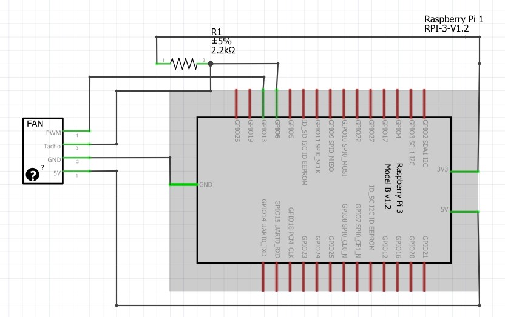

# pwm_simple_GPIO_6-13
Raspberry Pi simple PWM script

This is based on https://www.raspberrypi.org/forums/viewtopic.php?f=63&t=244194&start=25#p1514761 article post.

Hardware: 
- Raspberry Pi 4 B
- Noctua NF-A4x10 5V PWM 4 pins cooler
- A 2.2 kΩ resistor

Connexion of the 4 pin wire:
- Black wire: GND
- Yellow wire: 5V
- Green: Tacho on GPIO 6
- Blue: PWM on GPIO 13

Wire chart: 

I've just modified the following stuffs on the python script:
- default path to the rpm file
- new log file for the data output, so I can read them with a LUA script in Domoticz

I've also added a new simple systemd service.

Setup:
```
cd /home/pi
git clone THIS REPO pwm_fan
cd pwm_fan
chmod 755 /home/pi/pwm_fan/pwm_simple_GPIO_6-13.service
sudo ln -s /home/pi/pwm_fan/pwm_simple_GPIO_6-13.service /etc/systemd/system/pwm_simple_GPIO_6-13.service
sudo systemctl daemon-reload
sudo systemctl start pwm_simple_GPIO_6-13
sudo systemctl status -a pwm_simple_GPIO_6-13
sudo systemctl enable pwm_simple_GPIO_6-13
```
